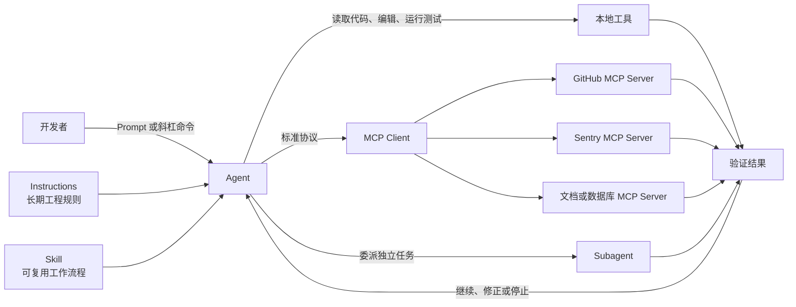
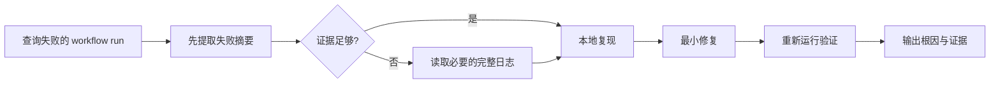
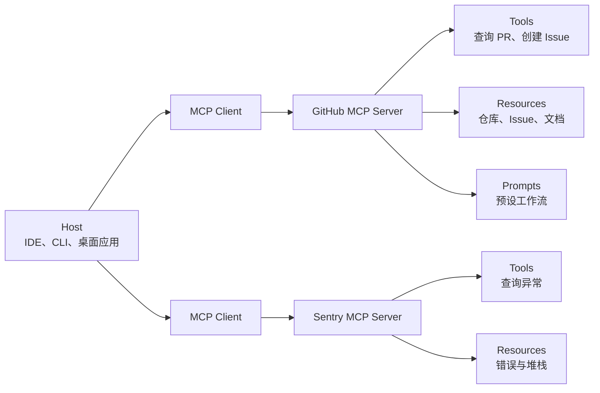
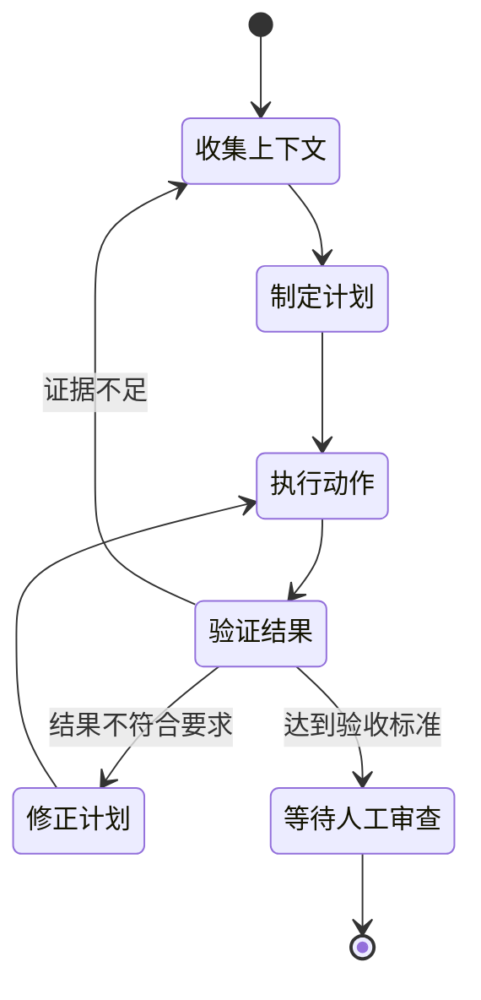
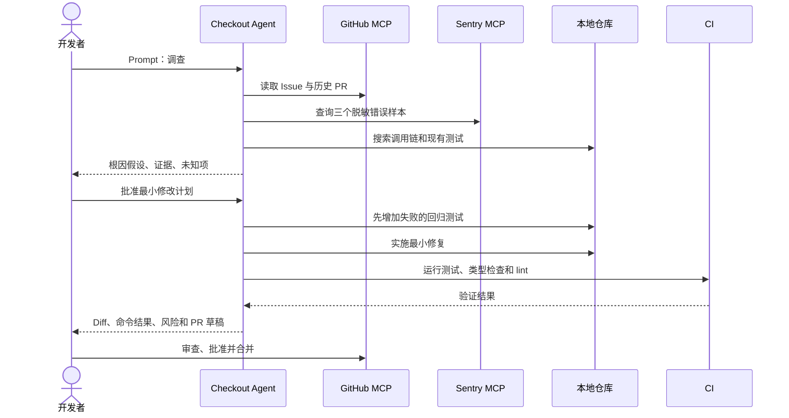
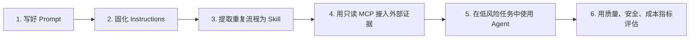

# AI 软件开发核心概念与 DevOps 实践

> 适合对象：希望系统理解 AI 编程助手、Agent 与 DevOps 工作流的开发者  
> 阅读时间：约 45 分钟  
> 资料核验：2026-09-13

AI 软件开发领域出现了许多容易混淆的概念：Prompt、斜杠命令、Instructions、Skill、MCP、Agent、Subagent。它们不是同一种能力，也不处于同一个层次。

先记住一句话：

> **Prompt 是本次工单，斜杠命令是快捷入口，Instructions 是团队手册，Skill 是标准作业程序，MCP 是连接外部系统的标准插座，Agent 是实际执行多步工作的智能工程师。**

## 1. 一张图看懂它们如何协作



从人的视角看：

```text
你说要做什么
  ↓
Agent 判断需要哪些上下文和步骤
  ↓
按需读取 Instructions 与 Skill
  ↓
使用本地工具或通过 MCP 访问外部系统
  ↓
检查结果，不符合要求就继续调整
  ↓
交给人审查、批准和合并
```

## 2. 核心概念对照表

| 概念 | 通俗类比 | 解决的问题 | 典型例子 |
|------|----------|------------|----------|
| Prompt（提示词） | 一张具体工单 | 这一次要做什么 | “修复登录超时问题并补回归测试” |
| Slash command（斜杠命令） | 快捷按钮 | 快速调用产品功能或预设任务 | `/plan`、`/review`、`/clear` |
| Instructions（长期指令） | 团队工程手册 | 这个仓库一直怎样工作 | 构建命令、目录规则、代码规范 |
| Prompt file（提示文件） | 可填写参数的工单模板 | 反复执行同类单次任务 | “为选中代码生成单元测试” |
| Skill（技能） | 带资料和脚本的 SOP | 某类复杂任务应该怎样完成 | CI 失败排查、发布前检查 |
| MCP | AI 工具的 USB-C | 怎样连接 GitHub、Sentry、数据库等系统 | 读取 Issue、查询错误、创建 PR |
| Agent（智能体） | 有工具和权限的临时工程师 | 怎样自主完成多步骤目标 | 调查、修改、测试并准备 PR |
| Subagent（子智能体） | 被临时委派的专员 | 怎样隔离大段检索或测试工作 | 只读代码调查、分析测试日志 |

## 3. Prompt：把任务写成可验收的工单

Prompt 是你本轮交给模型的请求，但模型最终看到的上下文通常不只这一段文字，还可能包括当前文件、聊天记录、仓库指令、Skill 内容和工具返回结果。

### 3.1 一个实用公式

```text
好 Prompt = 目标 + 现状与证据 + 约束 + 验收标准 + 停止条件
```

### 3.2 不够好的写法

```text
优化一下支付模块。
```

问题在于：

- “优化”没有可观察的结果；
- 没有说明修改范围；
- 没有说明什么不能改；
- 没有测试或验收标准；
- Agent 只能猜测你的真实意图。

### 3.3 更好的写法

```text
目标：
修复结账接口在优惠券过期时返回 500 的问题。

现状与证据：
- 问题记录：Issue #482
- 入口：POST /checkout
- 请先复现，不要直接修改代码。

约束：
- 不改变公开响应结构。
- 不新增运行时依赖。
- 修改范围限于 checkout 模块。

验收标准：
- 新增一个修复前失败、修复后通过的回归测试。
- 相关单元测试、类型检查和 lint 全部通过。

停止条件：
- 无法复现或证据不足时，停止并说明还缺少什么。
```

### 3.4 Prompt 最佳实践

1. **先目标，后细节**：先说要解决什么，再列实现限制。
2. **给证据**：附上错误、日志、文件路径、Issue 或失败测试。
3. **说清非目标**：明确哪些模块、依赖和公开行为不能改。
4. **使用可执行验收**：尽量用测试、命令和输出描述完成条件。
5. **大型任务分阶段**：研究 → 计划 → 实现 → 验证。
6. **允许停止**：证据不足时报告未知项，不要鼓励猜测。

更系统的写法可继续阅读：[提示词工程基础](./02-prompt-engineering.md)。

## 4. 斜杠命令：入口相同，背后的机制可能不同

斜杠命令通常以 `/` 开头，是具体产品提供的快捷入口。它不是一个跨产品统一协议，同一个命令在不同工具中可能不存在，或者含义不同。

### 4.1 常见的两类命令

**产品控制命令**

```text
/clear       清空或重开会话
/model       选择模型
/context     查看当前上下文
/diff        查看工作区改动
```

这类命令通常由工具本身直接处理。

**基于 Prompt 或 Skill 的任务命令**

```text
/plan
/review
/security-review
/generate-tests
```

这类命令可能向模型加载一段提示模板，也可能加载一个 Skill。外观看起来都是 `/名称`，但执行机制不同。

### 4.2 使用建议

- 用斜杠命令处理高频、含义稳定的动作；
- 先确认当前客户端支持哪些命令；
- 不要因为有 `/` 就认为它比普通 Prompt 更智能；
- 如果流程需要跨工具复用、脚本和参考资料，优先使用 Skill；
- 如果只是某个 IDE 中反复使用的一次性模板，可使用 Prompt file。

## 5. Instructions：把稳定的仓库事实交给 Agent

Instructions 是自动加载的长期规则，适合存放每个任务都可能需要的项目知识。

### 5.1 适合写入的内容

- 正确的安装、构建、测试和 lint 命令；
- 主要目录及其职责；
- 框架、语言和运行时版本；
- 代码风格与兼容性要求；
- 安全限制和禁止事项；
- 提交 PR 前必须完成的验证。

### 5.2 不适合写入的内容

- 某一个 Issue 的需求；
- 偶尔才执行一次的长流程；
- 未经验证或已经过时的命令；
- “写高质量代码”这类无法执行和验证的要求。

```text
Instructions：所有工作都遵守的规则
Prompt：这一次工作的目标和约束
Skill：遇到特定任务时采用的流程
```

## 6. Skill：把反复出现的做法变成 SOP

Skill 是可复用的说明、脚本和参考资料包。Agent 在相关任务中按需加载它，而不是把所有流程永久塞进上下文。

### 6.1 典型目录

```text
.github/skills/actions-failure-debugging/
├── SKILL.md
├── scripts/
│   └── classify-failure.py
└── references/
    └── common-failures.md
```

`SKILL.md` 至少应说明：

- 什么时候使用，什么时候不要使用；
- 输入是什么；
- 按什么顺序执行；
- 输出和验收标准是什么；
- 失败时如何停止或升级；
- 允许使用哪些工具；
- 附属脚本和资料放在哪里。

### 6.2 实际案例：GitHub Actions 失败排查 Skill



这个流程值得做成 Skill，因为它会反复出现，而且包含固定顺序、失败处理和可能复用的日志分类脚本。

### 6.3 什么时候不需要 Skill

```text
“所有任务都使用 pnpm”              → Instructions
“修复 Issue #482”                  → Prompt
“解释当前选中的函数”                → 斜杠命令或 Prompt file
“排查 Actions 失败并按规范复现”      → Skill
“连接 GitHub 并读取 workflow run”   → MCP
```

## 7. MCP：让 Agent 以统一方式连接外部系统

MCP（Model Context Protocol，模型上下文协议）是 AI 应用连接外部数据源、工具和工作流的开放协议。

它只负责“怎样连接和交换能力”，不负责决定 Agent 应该做什么，也不保证外部数据可信。

### 7.1 MCP 架构



### 7.2 MCP Server 提供什么

| 能力 | 含义 | 谁通常决定使用 |
|------|------|----------------|
| Tools | 可执行操作，例如查询 PR、搜索、写入外部系统 | 模型可选择调用 |
| Resources | 可读取的上下文，例如文件、数据库结构、文档 | 应用选择并提供 |
| Prompts | 参数化的消息或工作流模板 | 用户显式选择 |

### 7.3 DevOps 中的典型用途

- **GitHub MCP**：读取 Issue、PR、代码和 workflow run；
- **Sentry MCP**：查询异常样本和堆栈；
- **Playwright MCP**：操作测试环境中的网页并截图；
- **内部文档 MCP**：查询运行手册、服务目录和故障预案；
- **数据库 MCP**：只读查询开发或测试数据。

### 7.4 不要把 MCP 理解成“万能插件”

```text
MCP 提供：可访问的数据和可调用的工具
Skill 提供：完成任务的方法
Agent 负责：根据目标规划、调用、判断和验证
人负责：授权高风险操作并审查最终结果
```

## 8. Agent：会循环执行和验证的工作系统

Agent 不是一个更长的 Prompt。它通常由语言模型、上下文管理、工具、权限和执行环境组成，并围绕目标反复行动。



### 8.1 Agent 与普通聊天的区别

| 普通聊天 | Agent |
|----------|-------|
| 通常一次问答 | 多步骤循环 |
| 主要生成文字 | 可以读取、编辑和执行工具 |
| 用户决定每一步 | 可在权限范围内自行规划 |
| 很少验证真实结果 | 可以运行测试并根据结果调整 |

### 8.2 好 Agent 按职责和权限定义

```yaml
---
name: checkout-fixer
description: 修复 checkout 模块中可复现的小型缺陷
tools:
  - repository-read
  - edit
  - test
  - sentry/read-issues
---

只修改 checkout 模块。
先复现，再写回归测试，再做最小修复。
不得修改部署配置、数据库结构或公开接口。
证据不足、需要跨仓库修改或测试持续失败时停止并报告。
```

重点不是给 Agent 一个“资深工程师人格”，而是说清：

- 它负责什么；
- 它不负责什么；
- 可以使用哪些工具；
- 可以修改哪些范围；
- 必须返回哪些证据；
- 什么时候必须停止并交给人。

### 8.3 Subagent 什么时候有价值

Subagent 在独立上下文中处理被委派的任务，适合：

- 大范围只读代码搜索；
- 分析大量测试或构建日志；
- 独立安全审查；
- 并行调查互不依赖的问题。

简单任务不应为了“看起来智能”而拆成多个 Subagent。多 Agent 会增加成本、上下文丢失、协调冲突和观察难度。

## 9. 完整案例：线上 500 到修复 PR

### 9.1 场景

支付系统出现故障：使用过期优惠券时，`POST /checkout` 返回 500；正确行为应是返回已有的 `COUPON_EXPIRED` 业务错误。

目标是完成一个小型、单仓库、可回滚的修复，而不是让 Agent 自主操作生产环境。

### 9.2 角色分工图



### 9.3 第一步：人定义 Issue

Issue 应包含：

- 脱敏后的请求和响应样本；
- Sentry 事件链接；
- 预期行为；
- 非目标；
- 回归测试和兼容性要求。

此时，**Issue 和补充说明构成了 Prompt 的主要输入**。

### 9.4 第二步：Agent 只读调查

```text
调查 #482。
通过只读 Sentry MCP 获取最近三个同类事件，
通过 GitHub MCP 读取 Issue 和相关历史 PR，
在仓库中定位调用链和现有测试。

不要修改文件。
输出：根因假设、证据、未知项、建议验证步骤。
```

这里：

- GitHub 和 Sentry 通过 **MCP** 提供外部证据；
- 仓库 **Instructions** 告诉 Agent 正确的目录和验证命令；
- Explore **Subagent** 可以隔离大量代码搜索结果；
- 证据不足时，Agent 应停止而不是编造根因。

### 9.5 第三步：先计划，再实施

可以通过 `/plan` 或普通 Prompt 要求：

```text
基于调查结果制定最小修复计划。
列出拟修改文件、回归测试、兼容性风险和验证命令。
不要写代码。
```

计划获批后：

```text
实施已确认的计划。
先提交失败的回归测试，再做最小修复。
使用 checkout-regression-testing Skill。
不得修改 workflow、依赖版本或公开接口。
```

### 9.6 第四步：验证并准备 PR

PR 至少应说明：

- 根因和证据；
- 修改范围；
- 修复前失败、修复后通过的测试；
- 实际运行的命令和结果；
- 未运行的检查及原因；
- 风险与回滚方式；
- 对应 Issue。

人工审查重点：

1. Diff 是否超出范围；
2. 测试是否真的覆盖故障条件；
3. 是否修改依赖、工作流、权限或外部调用；
4. 公开接口是否保持兼容；
5. 证据能否支持 Agent 的结论。

### 9.7 第五步：部署仍由现有流水线负责

合并后由原有 CD 流水线部署。部署后 Agent 可以使用只读监控能力做验证：

```text
查询本次部署后 30 分钟内 checkout 的
COUPON_EXPIRED 数量、500 比例和相关 Sentry 事件，
并与部署前等长窗口比较。

只读，不执行回滚。
```

若指标异常，Agent 汇总证据并建议回滚；现有自动回滚策略或值班人员决定是否执行。

## 10. 安全护栏：能力越强，权限越要小

### 10.1 Prompt injection

Agent 读取的仓库文件、Issue、PR、日志、网页、MCP Resource 和工具返回值都可能包含恶意文本，试图诱导 Agent 忽略原规则。

实践原则：

> **把外部内容当作数据，不要当作可信指令。**

### 10.2 最小权限

| 风险 | 推荐护栏 |
|------|----------|
| Agent 误删文件 | 默认逐次批准写操作，禁止宽泛删除权限 |
| MCP 泄露数据 | 只连接可信 Server，限制文件和网络范围 |
| 误改生产系统 | 诊断身份只读，写操作使用独立凭据和审批 |
| Skill 携带恶意脚本 | 安装前审查 `SKILL.md`、脚本、依赖和网络访问 |
| 自动推送或部署 | 创建 PR、合并、部署分级授权 |
| 外部内容提示注入 | 隔离不可信内容，人工检查高风险动作 |

### 10.3 推荐的自治等级

```text
Level 1  只读研究
   ↓
Level 2  允许本地编辑，但不提交或推送
   ↓
Level 3  允许运行已批准的测试
   ↓
Level 4  允许创建分支或 PR
   ↓
Level 5  合并、部署、删数据仍需人工批准
```

从低风险、小范围、测试充分的任务开始。只有质量、安全和成本都达到预设标准后，才提高自治等级。

## 11. 如何判断 AI DevOps 是否真的有效

不要只统计“生成了多少行代码”或“接受了多少建议”。这些是活动量，不是交付结果。

### 11.1 单任务指标

| 维度 | 建议指标 |
|------|----------|
| 正确性 | 验收测试通过率、首次 CI 通过率 |
| 完整性 | 首次 PR 满足全部验收标准的比例 |
| 人工成本 | 人工修正次数、Review 往返次数 |
| 范围控制 | 越界修改率、非目标文件修改数 |
| 可信度 | 不可验证声明率、错误引用数 |
| 安全 | 越权请求、危险工具调用、秘密泄漏数 |
| 效率 | 到可审 PR 的耗时、Token、执行分钟和费用 |

### 11.2 团队与交付指标

- PR 合并时间中位数；
- PR 关闭未合并比例；
- CI 重跑次数；
- 合并后 7/30 天内的回滚和缺陷逃逸率；
- DORA 指标：变更前置时间、部署频率、失败部署恢复时间、变更失败率和部署返工率。

### 11.3 一个更可靠的试验方法

1. 选择 20–50 个小型、脱敏、可自动验证的历史任务；
2. 固定模型、Instructions、Skills 和权限；
3. 比较人工、AI 辅助、Agent + Skills + 只读 MCP 三组；
4. 使用同一套测试和人工评分标准；
5. 同时报告中位数、失败分布和最差案例；
6. 修改规则、Skill 或权限后重新运行基准集；
7. 达到质量、安全和成本阈值后再扩大范围。

## 12. 推荐的入门顺序



不推荐一开始就：

- 把生产数据库、部署和删除权限全部交给 Agent；
- 连接大量不相关 MCP Server；
- 为简单任务创建复杂的多 Agent 系统；
- 在没有测试和验收标准时追求“全自动”；
- 把成功演示当作稳定工程能力。

## 13. 参考资料

以下资料以官方文档和开放规范为主：

- [GitHub：Prompt engineering for GitHub Copilot](https://docs.github.com/en/copilot/concepts/prompting/prompt-engineering)
- [GitHub：Copilot customization cheat sheet](https://docs.github.com/en/copilot/reference/customization-cheat-sheet)
- [GitHub：Copilot CLI command reference](https://docs.github.com/en/copilot/reference/copilot-cli-reference/cli-command-reference)
- [GitHub：About agent skills](https://docs.github.com/en/copilot/concepts/agents/about-agent-skills)
- [GitHub：Adding agent skills for Copilot CLI](https://docs.github.com/en/copilot/how-tos/copilot-cli/customize-copilot/add-skills)
- [GitHub：About MCP](https://docs.github.com/en/copilot/concepts/context/mcp)
- [GitHub：About Copilot cloud agent](https://docs.github.com/en/copilot/concepts/agents/cloud-agent/about-cloud-agent)
- [GitHub：Cloud agent risks and mitigations](https://docs.github.com/en/copilot/concepts/agents/cloud-agent/risks-and-mitigations)
- [Anthropic：How Claude Code works](https://code.claude.com/docs/en/how-claude-code-works)
- [Anthropic：Extend Claude with skills](https://code.claude.com/docs/en/skills)
- [Anthropic：Create custom subagents](https://code.claude.com/docs/en/sub-agents)
- [Agent Skills specification](https://agentskills.io/specification)
- [MCP：What is MCP?](https://modelcontextprotocol.io/docs/2026-07-28/getting-started/intro.md)
- [MCP：Architecture overview](https://modelcontextprotocol.io/docs/2026-07-28/learn/architecture.md)
- [MCP：Security best practices](https://modelcontextprotocol.io/docs/2026-07-28/tutorials/security/security_best_practices.md)
- [DORA：DORA metrics](https://dora.dev/guides/dora-metrics/)

---

**结论：** AI DevOps 的最佳实践不是“让 Agent 全自动交付”，而是用清晰 Prompt 定义任务，用 Instructions 保存稳定规则，用 Skill 固化重复流程，用 MCP 提供受控的外部能力，再让 Agent 在最小权限下研究、行动和验证，最后由人审查高风险决策。
