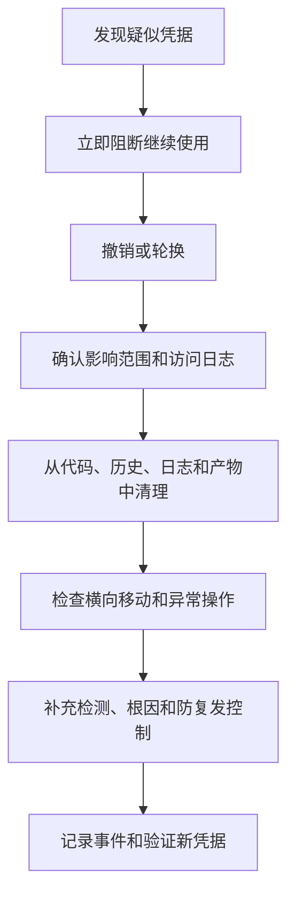

# 代码安全规范

> 默认验证基线：OWASP ASVS 5.0 Level 2  
> 高价值、特权、安全关键或强监管系统：评估采用 ASVS Level 3  
> 核心要求：任何源码、配置、日志、测试、文档和 Prompt 中都不得出现明文真实凭据。

## 1. 标准基线

- **MUST**：使用 OWASP ASVS 5.0 作为可验证的应用安全要求。
- **MUST**：普通企业应用至少采用 Level 2。
- **MUST**：安全缺陷关联适用的 CWE，例如：
  - CWE-798：硬编码凭据；
  - CWE-532：日志中的敏感信息；
  - CWE-89：SQL 注入；
  - CWE-78：命令注入；
  - CWE-918：SSRF；
  - CWE-287：认证不当；
  - CWE-862：缺失授权；
  - CWE-327：高风险加密算法。
- **MUST**：安全开发生命周期覆盖 NIST SSDF 的 Prepare、Protect、Produce、Respond 四类实践。
- **MUST**：威胁模型和验证计划覆盖 OWASP Top 10:2025。
- **SHOULD**：安全需求可测试，并能从需求链接到测试、扫描结果和发布证据。

## 2. 凭据与秘密

### 2.1 绝对禁止

真实秘密 **MUST NOT** 出现在：

- Java、SQL、Shell 或其他源代码；
- `application.yml`、`application.properties`、`.env` 等配置；
- GitHub Actions workflow；
- Dockerfile、镜像层或 Kubernetes manifest；
- 测试 fixture、快照和样例数据；
- 日志、trace、异常、crash dump 和遥测；
- README、ADR、SOP 和架构图；
- Prompt、Copilot Instructions、Skill、Issue、PR 或评论；
- MCP 配置；
- 截图和录屏。

秘密包括但不限于密码、API key、token、私钥、连接字符串、webhook secret、签名密钥、真实客户数据和仍可使用的测试凭据。

Base64、URL 编码或加密后但可直接恢复的值仍按秘密处理。

### 2.2 配置示例

禁止：

```properties
# UNSAFE
spring.datasource.url=jdbc:postgresql://db.internal/payments
spring.datasource.username=payments_admin
spring.datasource.******=<plaintext-password>
provider.api-key=<plaintext-api-key>
```

推荐：

```yaml
database:
  secretRef: secret-manager://payments/prod/database
  role: payments-api
```

本地模板只能使用明显无效的占位符：

```dotenv
DATABASE_SECRET_REF=secret-manager://example/local/database
PAYMENT_API_KEY=replace-with-local-test-value
```

### 2.3 秘密管理

- **MUST**：生产秘密来自批准的 Secret Manager、KMS 或工作负载身份系统。
- **MUST**：不同环境、工作负载和权限使用不同身份。
- **MUST**：最小权限、可审计读取、轮换、撤销和到期。
- **MUST**：CI 与云平台优先使用 OIDC 和短期凭据，不保存长期云密钥。
- **MUST**：测试使用无效占位符、临时测试身份、模拟器或隔离环境。
- **MUST**：泄露后立即撤销或轮换；仅删除文件或重写 Git 历史不算完成处置。
- **SHOULD**：自动生成和轮换秘密。
- **SHOULD**：测试 Secret Manager 故障和轮换过程。

### 2.4 Java 中的秘密

```java
public interface SecretProvider {
  SecretValue get(String reference);
}

public final class SecretValue implements AutoCloseable {
  private final char[] value;

  public SecretValue(char[] value) {
    this.value = value.clone();
  }

  public char[] copy() {
    return value.clone();
  }

  @Override
  public void close() {
    Arrays.fill(value, '\0');
  }
}
```

特别敏感且短期使用的值 **SHOULD** 避免长期保存在不可清除的 `String` 中。

## 3. 输入验证与注入防护

- **MUST**：所有信任边界输入在服务端验证，包括 HTTP、Header、Cookie、文件、消息、数据库内容、Webhook、AI 输出和 MCP 结果。
- **MUST**：验证类型、长度、大小、允许值、数值/日期范围、业务语义和嵌套深度。
- **MUST NOT**：把前端验证当作安全控制。
- **MUST**：可枚举输入使用 allowlist。
- **MUST**：SQL、HQL、LDAP 等查询使用参数化接口。
- **MUST NOT**：将用户数据拼接进 SQL、命令或表达式。
- **MUST NOT**：用不可信字符串拼接 OS 命令；优先使用库接口。
- **MUST**：输出按真实上下文编码，如 HTML、URL、CSV、日志或 Shell。
- **MUST**：富文本使用维护中的专用清洗库。
- **MUST**：限制反序列化格式、类型、深度和大小。

禁止：

```java
String customerId = request.getParameter("customerId");
String sql = "SELECT * FROM accounts WHERE customer_id = '" + customerId + "'";
ResultSet result = connection.createStatement().executeQuery(sql);
```

推荐：

```java
String customerId = request.getParameter("customerId");
if (!customerId.matches("[A-Z0-9]{8,24}")) {
  throw new BadRequestException("Invalid customer identifier");
}

try (PreparedStatement statement = connection.prepareStatement(
    "SELECT account_id, balance FROM accounts WHERE customer_id = ?")) {
  statement.setString(1, customerId);
  try (ResultSet result = statement.executeQuery()) {
    // Process a bounded result set.
  }
}
```

## 4. 认证、会话与授权

### 4.1 认证

- **MUST**：使用维护中的身份协议和框架，不自创认证协议。
- **MUST**：管理员、生产访问者和源代码管理员使用 MFA。
- **MUST NOT**：发布默认账号或默认密码。
- **MUST**：密码使用批准的自适应密码哈希，不可逆加密，不使用 MD5/SHA-1。
- **MUST**：认证与找回响应避免账号枚举。
- **MUST**：限制和监控暴力破解、密码喷洒和凭据填充。
- **MUST**：JWT/OAuth/OIDC 验证签名、允许算法、issuer、audience、时间声明、nonce/state 和 scope。

### 4.2 会话

- **MUST**：会话 ID 具有高熵。
- **MUST**：登录和权限变化后轮换会话。
- **MUST**：Cookie 使用 `Secure`、`HttpOnly` 和合适的 `SameSite`。
- **MUST**：设置空闲与绝对过期。
- **MUST**：登出、撤销和高风险事件后失效。

### 4.3 授权

- **MUST**：每个请求和每个对象在服务端授权。
- **MUST**：默认拒绝和最小权限。
- **MUST**：检查资源所有权和 tenant 隔离；拥有 ID 不代表拥有权限。
- **MUST**：特权操作有明确策略检查和审计事件。
- **MUST**：测试跨用户、跨角色和跨租户拒绝场景。
- **MUST NOT**：只在 UI 或 API Gateway 做授权。

禁止：

```java
@GetMapping("/accounts/{id}")
public Account account(@PathVariable long id) {
  return repository.findById(id).orElseThrow();
}
```

推荐：

```java
@GetMapping("/accounts/{id}")
@PreAuthorize("isAuthenticated()")
public AccountView account(
    @PathVariable long id,
    Authentication authentication) {

  return repository
      .findAuthorizedAccount(id, authentication.getName())
      .map(AccountView::from)
      .orElseThrow(NotFoundException::new);
}
```

授权条件应进入查询或事务，避免先读取后检查产生竞态或被其他调用路径遗漏。

## 5. SSRF 与出站访问

- **MUST NOT**：没有业务需求和 SSRF 控制时请求用户提供的 URL。
- **MUST**：已知目的地使用 scheme、host、port 和 path allowlist。
- **MUST**：阻断 loopback、link-local、private、multicast、metadata 和内部地址，除非明确批准。
- **MUST**：考虑 IPv4、IPv6、数字变体和 DNS rebinding。
- **MUST**：禁用自动重定向，或重新验证每个跳转目标。
- **MUST**：使用网络 egress policy 独立限制可达目的地。
- **MUST**：限制响应大小、类型和超时。
- **MUST NOT**：向任意目标转发内部凭据和 Header。

应用检查必须与防火墙或代理 allowlist 配合，单靠 Java 代码不足以形成安全边界。

## 6. 加密与敏感数据

- **MUST**：最小化敏感数据收集和保留。
- **MUST**：敏感数据传输加密；按分类要求静态加密。
- **MUST**：使用批准且维护中的加密库。
- **MUST NOT**：自创加密算法。
- **MUST**：新对称加密使用 AES-GCM 等认证加密。
- **MUST**：同一密钥下 nonce/IV 不重复。
- **MUST**：安全 token、key、nonce、reset code 使用 `SecureRandom`。
- **MUST**：密钥按用途隔离并由 KMS/HSM 管理。
- **MUST NOT**：安全用途使用 MD5、SHA-1、ECB、未认证加密或可预测随机数。
- **MUST NOT**：使用“信任所有证书”或宽松 hostname verifier。
- **MUST**：上线前定义轮换、撤销、恢复和 crypto agility。

禁止：

```java
Cipher cipher = Cipher.getInstance("AES/ECB/PKCS5Padding");
```

推荐：

```java
byte[] nonce = new byte[12];
SecureRandom.getInstanceStrong().nextBytes(nonce);

Cipher cipher = Cipher.getInstance("AES/GCM/NoPadding");
cipher.init(
    Cipher.ENCRYPT_MODE,
    keyFromKms,
    new GCMParameterSpec(128, nonce));
cipher.updateAAD(recordId.getBytes(StandardCharsets.UTF_8));
byte[] ciphertext = cipher.doFinal(plaintext);
```

nonce 必须和密文一起保存，并保证同一密钥下唯一。

## 7. 安全日志与错误

必须记录：

- 认证事件和授权失败；
- 服务端验证失败；
- 特权操作和配置变更；
- 密钥/秘密生命周期；
- 敏感数据访问；
- 安全控制失败。

禁止记录：

- 密码、token、session ID、私钥和连接字符串；
- 完整支付或身份数据；
- 默认记录完整请求/响应体；
- `Authorization` Header；
- 含用户数据的原始 SQL；
- 未经字段分类的完整 Java 对象。

```java
log.warn(
    "authentication_failed userIdHash={} sourceIp={} reason={} traceId={}",
    auditHash(username),
    normalizedSourceIp,
    FailureReason.INVALID_CREDENTIALS,
    traceId);
```

- **MUST**：外部错误使用统一、最少披露的信息。
- **MUST**：内部日志有访问控制、完整性、时间同步和保留策略。
- **MUST**：安全决策失败时 fail closed。
- **MUST**：失败事务安全回滚。

## 8. 依赖、SBOM 与构建完整性

- **MUST**：使用声明的 manifest 和生态支持的 lock file。
- **MUST**：启用 GitHub dependency graph 与 Dependabot alerts。
- **SHOULD**：启用 Dependabot security/version updates。
- **MUST**：manifest 或 lock file 变化时运行 dependency review。
- **MUST**：按漏洞、维护状态、来源、许可证、必要性和传递风险评估依赖。
- **MUST**：漏洞例外有范围、负责人、补偿控制和到期时间。
- **MUST**：发布产物提供 SPDX 或 CycloneDX SBOM。
- **SHOULD**：发布产物携带签名 provenance/attestation。
- **MUST**：受保护环境使用前验证 provenance。
- **SHOULD**：构建环境临时、隔离、可复现，并限制网络。
- **SHOULD**：包发布使用 OIDC 或 trusted publishing。

Attestation 证明产物来源和构建信息，不证明软件没有漏洞。

## 9. GitHub 仓库安全控制

### 9.1 Secret scanning 与 push protection

- **MUST**：对所有支持的仓库启用 secret scanning。
- **MUST**：启用 push protection。
- **SHOULD**：配置组织自定义 secret pattern 和 validity checks。
- **MUST**：真实告警先撤销/轮换，再清理和调查。
- **SHOULD NOT**：普通贡献者自行 bypass。
- **MUST**：bypass 有记录、评审和到期时间。

### 9.2 Code scanning

- **MUST**：启用 CodeQL 或等效 SARIF SAST。
- **MUST**：扫描 PR、默认分支和定期扫描。
- **MUST**：新引入的高危/严重结果阻断合并。
- **MUST**：扫描 GitHub Actions workflow。
- **MUST**：dismissal 有独立评审和理由。

### 9.3 Ruleset 与 CODEOWNERS

默认和发布分支 **MUST**：

- 仅通过 PR 修改；
- 要求独立人工审批；
- 要求 required checks；
- 要求安全敏感路径的 CODEOWNER；
- 禁止 force push 和删除；
- 限制 bypass 到受审计的 break-glass 组；
- 禁止自我审批；
- 新 push 后重新审批或清除过期审批。

以下路径 **MUST** 有专门 CODEOWNER：

```text
.github/workflows/**
.github/copilot-instructions.md
.github/instructions/**
.github/agents/**
.github/skills/**
.vscode/mcp.json
认证与授权代码
加密与秘密管理代码
构建、发布、部署和基础设施代码
```

## 10. GitHub Actions 安全

- **MUST**：默认 `GITHUB_TOKEN` 只读，并在 job 级声明最小权限。
- **MUST**：云访问使用 OIDC。
- **MUST**：第三方 Action 固定到评审过的完整 commit SHA。
- **MUST**：不把不可信 GitHub context 直接插入 Shell。
- **MUST**：不在高权限 workflow 中 checkout 并执行不可信 PR 代码。
- **MUST**：构建测试与发布部署 workflow 分离。
- **MUST**：生产 environment 要求审批者。
- **MUST**：不可信 job 的 artifact、cache 和 output 仍按不可信处理。
- **MUST**：公开或不可信 PR 使用临时、隔离 runner。
- **MUST NOT**：普通持久化 self-hosted runner 执行 fork PR。

禁止：

```yaml
permissions: write-all

steps:
  - uses: third-party/build-action@main
  - run: echo "${{ github.event.pull_request.title }}"
```

推荐：

```yaml
permissions:
  contents: read

steps:
  - uses: actions/checkout@<reviewed-full-commit-sha>
    with:
      persist-credentials: false
  - name: Validate PR title
    env:
      PR_TITLE: ${{ github.event.pull_request.title }}
    run: ./scripts/validate-pr-title "$PR_TITLE"
```

## 11. Copilot 与 AI 生成代码安全

- **MUST**：AI 生成代码按不可信代码处理。
- **MUST**：经过编译、测试、SAST、secret scanning、dependency review、许可证检查和人工评审。
- **MUST**：安全敏感变更由具备资格且独立的人评审。
- **MUST NOT**：Copilot Review 作为受保护生产分支的唯一审批。
- **MUST**：核对 AI 提议的依赖、接口、版本和安全控制。
- **MUST**：检查硬编码秘密、遗漏授权、注入、SSRF、弱加密、敏感日志、不安全反序列化和编造依赖。
- **MUST**：安全变更包含负向和滥用测试。

重要信任问题：Copilot Code Review 可能读取 PR head branch 中的 Instructions 和 Skills。来自不可信 PR 的这些文件也受攻击者控制，不能被当作受保护分支的权威安全策略。

## 12. Prompt Injection、Skill 与 MCP

- **MUST**：用户 Prompt、Issue、PR、仓库文件、网页、日志、MCP 响应和工具输出全部按不可信数据处理。
- **MUST NOT**：让不可信内容中的自然语言覆盖权限和工具限制。
- **MUST**：安全边界由确定性代码和基础设施执行。
- **MUST NOT**：给模型宽泛凭据。
- **MUST**：合并、部署、权限、秘密、发布、删除和资金操作要求人工批准。
- **MUST**：Agent 环境尽量临时、沙箱化并限制 egress。
- **MUST**：模型输出经过 schema 验证后才能执行、入库或渲染。
- **MUST**：工具调用、批准、输入输出和身份可审计。
- **MUST**：威胁模型包含 Prompt Injection 和工具滥用。

MCP：

- **MUST**：仅启用审查批准的 Server。
- **MUST**：显式 allowlist 必要工具。
- **SHOULD NOT**：使用 `["*"]`。
- **SHOULD**：默认只读。
- **MUST**：秘密存储为 Agent secret，不写入 MCP JSON。
- **MUST**：审查来源、更新方式、网络目的地、认证、数据保留和工具语义。

Skill：

- **MUST**：像可执行依赖一样审查。
- **MUST**：第三方版本固定到已评审 tag，优先 commit SHA。
- **MUST NOT**：未经完全审查预批准 shell。
- **MUST**：变更由 CODEOWNER 审批。

## 13. 最低合并与发布门禁

生产变更在以下条件全部满足前 **MUST NOT** 合并：

1. 独立人工审批完成；
2. CODEOWNER 审批完成；
3. 构建和测试通过；
4. Code scanning 无未接受的阻断结果；
5. Dependency review 无禁止项；
6. Secret scanning 无未处理真实秘密；
7. Workflow 和基础设施策略检查通过；
8. 安全讨论已解决；
9. 新依赖和生成代码已审查；
10. 例外有期限并获批准。

生产发布在以下条件满足前 **MUST NOT** 提升：

1. 来自受保护源码 revision；
2. 记录 artifact digest；
3. 生成并保留 SBOM；
4. 生成并验证 provenance；
5. 发布凭据短期且最小权限；
6. 环境审批和审计启用；
7. 安全例外仍有效；
8. 回滚和事故响应 SOP 可用。

## 14. 凭据泄露响应 SOP



优先级必须是**撤销/轮换**，而不是先删除 Git commit。

## 15. 主要依据

- [OWASP ASVS](https://owasp.org/www-project-application-security-verification-standard/)
- [OWASP Top 10:2025](https://owasp.org/Top10/2025/)
- [NIST SP 800-218 SSDF](https://csrc.nist.gov/pubs/sp/800/218/final)
- [CWE](https://cwe.mitre.org/)
- [OWASP Secrets Management Cheat Sheet](https://cheatsheetseries.owasp.org/cheatsheets/Secrets_Management_Cheat_Sheet.html)
- [OWASP Input Validation Cheat Sheet](https://cheatsheetseries.owasp.org/cheatsheets/Input_Validation_Cheat_Sheet.html)
- [OWASP SSRF Prevention Cheat Sheet](https://cheatsheetseries.owasp.org/cheatsheets/Server_Side_Request_Forgery_Prevention_Cheat_Sheet.html)
- [OWASP Cryptographic Storage Cheat Sheet](https://cheatsheetseries.owasp.org/cheatsheets/Cryptographic_Storage_Cheat_Sheet.html)
- [GitHub Secret scanning](https://docs.github.com/en/code-security/concepts/secret-security/secret-scanning)
- [GitHub Push protection](https://docs.github.com/en/code-security/concepts/secret-security/push-protection)
- [GitHub Code scanning](https://docs.github.com/en/code-security/concepts/code-scanning/code-scanning)
- [GitHub Actions secure use](https://docs.github.com/en/actions/reference/security/secure-use)
- [GitHub Copilot responsible use](https://docs.github.com/en/copilot/responsible-use/agents)
- [OWASP LLM Prompt Injection](https://genai.owasp.org/llmrisk/llm01-prompt-injection/)

