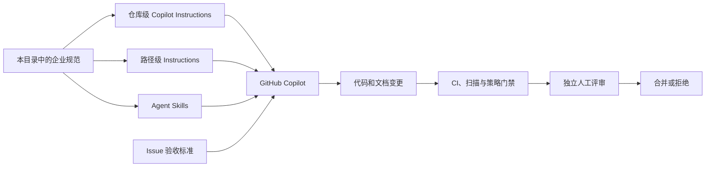

# 企业级软件 DevOps 规范与标准

> 适用范围：使用 GitHub、GitHub Actions 与 GitHub Copilot 进行研发的软件项目  
> 基线日期：2026-09-13  
> 文档性质：企业内部基线模板，采用前应结合业务风险、监管要求和现有平台能力评审

本目录提供一组可执行、可审计、可被 GitHub Copilot 正确理解的企业级软件 DevOps 规范。目标不是让 AI 代替工程治理，而是把工程规则写成仓库内的明确约束，再由自动化检查和人工审批落实。

## 1. 规范目录

| 文档 | 主要内容 |
|------|----------|
| [01. AI 辅助开发项目结构规范](./01-ai-assisted-project-structure.md) | 面向人和 Copilot 的仓库结构、文档、Instructions、Skill、Agent、MCP、CI 与所有权 |
| [02. Java 编码规范](./02-java-coding-standard.md) | Java 工具链、格式、包结构、空值、不可变性、异常、并发、日志、测试与依赖 |
| [03. 代码安全规范](./03-secure-coding-standard.md) | 凭据、输入、认证授权、SSRF、加密、日志、供应链、GitHub 与 AI 安全 |
| [04. HTTP API 设计规范](./04-http-api-design-standard.md) | HTTP 语义、状态码、URI、错误模型、OpenAPI、幂等、缓存、分页、版本与追踪 |

## 2. 规范用语

| 用语 | 含义 |
|------|------|
| **MUST / 必须** | 强制要求。例外必须有风险接受记录、负责人、补偿控制和到期时间 |
| **MUST NOT / 禁止** | 明确禁止。不得仅凭口头同意绕过 |
| **SHOULD / 应当** | 默认采用。偏离时必须记录技术理由和替代措施 |
| **SHOULD NOT / 不应** | 默认不采用。采用时必须说明必要性和风险 |
| **MAY / 可以** | 按业务规模、风险和平台能力选择 |

文档中的 MUST/SHOULD/MAY 是本规范建议的企业治理等级；除非明确标记为协议要求，否则不表示引用的外部标准使用了相同的规范性措辞。

## 3. 核心原则

1. **仓库是事实入口**：项目目标、架构、构建命令、测试方法和变更规则应能从仓库找到。
2. **单一事实来源**：Java 版本由构建配置定义，API 契约由 OpenAPI 定义，命令由 Wrapper 与 CI 证明；Copilot Instructions 只引用和摘要，不复制另一套规则。
3. **AI 生成代码不享有信任特权**：必须经过与人工代码相同的构建、测试、扫描和独立人工评审。
4. **安全由确定性控制保证**：权限、分支保护、CI 门禁、策略引擎和运行时控制不能只依赖自然语言提示。
5. **最小权限与分级自治**：默认只读；编辑、执行、提交、合并、部署和生产变更逐级授权。
6. **变更必须可验证**：需求应包含验收标准；实现应包含测试、扫描结果和风险证据。
7. **异常路径是一等公民**：SOP 必须定义失败、停止、升级和回滚路径。

## 4. Copilot 如何使用这些规范



### 4.1 应写入 Copilot Instructions 的内容

- 项目概况和关键入口；
- 经过验证的构建、测试和格式化命令；
- 模块依赖和不可突破的架构约束；
- 所有任务都适用的安全规则；
- 生成代码目录和禁止手工修改的路径；
- 完成任务前必须提供的证据。

### 4.2 不应只写入 Copilot Instructions 的内容

- 强制安全门禁；
- 权限和审批策略；
- 某一个 Issue 的临时需求；
- 很少使用的长流程；
- 凭据和生产数据；
- 可以由编译器、格式化器、测试或策略工具自动执行的规则。

> Instructions 提醒 Agent；CI 和平台策略执行规则；人工对最终决策负责。

## 5. 规范采用流程

```text
评估业务风险
  ↓
选择适用的 MUST / SHOULD 项
  ↓
确定自动化执行方式和负责人
  ↓
配置仓库、CI、扫描与审批
  ↓
使用历史任务和攻击场景验证
  ↓
试运行并记录例外
  ↓
定期复审和更新版本
```

建议至少每半年复审一次；当 Java LTS、GitHub Copilot 能力、OWASP ASVS、HTTP RFC 或监管要求发生重大变化时，应提前复审。

## 6. 例外管理

任何 MUST/MUST NOT 例外至少记录：

```yaml
rule: SEC-SECRET-001
reason: 旧系统尚未支持工作负载身份
scope: legacy-reporting production deploy job
owner: platform-security
approvedBy: security-review-board
compensatingControls:
  - 凭据仅可部署使用
  - 每 30 天自动轮换
  - 所有使用记录进入安全审计日志
expiresAt: 2026-12-31
trackingIssue: SEC-1842
```

过期例外必须自动阻断或重新审批，不得无限期延续。

## 7. 最低落地基线

一个生产项目至少应具备：

- [ ] `README.md`、`CONTRIBUTING.md`、`SECURITY.md`
- [ ] Maven/Gradle Wrapper 和唯一的完整验证命令
- [ ] 仓库级 Copilot Instructions
- [ ] 单元测试、集成测试和 required CI
- [ ] CODEOWNERS、受保护分支或 ruleset、独立人工审批
- [ ] Secret scanning、push protection、CodeQL 或等效 SAST
- [ ] Dependabot、dependency review、SBOM
- [ ] 不含真实凭据的配置模板
- [ ] OpenAPI 契约和兼容性检查
- [ ] 发布、回滚和事故响应 SOP
- [ ] Agent、Skill、MCP 配置的安全负责人

## 8. 主要依据

- [GitHub Copilot customization cheat sheet](https://docs.github.com/en/copilot/reference/customization-cheat-sheet)
- [GitHub Copilot responsible use](https://docs.github.com/en/copilot/responsible-use/agents)
- [NIST Secure Software Development Framework](https://csrc.nist.gov/pubs/sp/800/218/final)
- [OWASP ASVS](https://owasp.org/www-project-application-security-verification-standard/)
- [OWASP Top 10:2025](https://owasp.org/Top10/2025/)
- [Google Java Style Guide](https://google.github.io/styleguide/javaguide.html)
- [RFC 9110: HTTP Semantics](https://www.rfc-editor.org/rfc/rfc9110.html)
- [RFC 9457: Problem Details for HTTP APIs](https://www.rfc-editor.org/rfc/rfc9457.html)
- [OpenAPI 3.1.1](https://spec.openapis.org/oas/v3.1.1.html)

